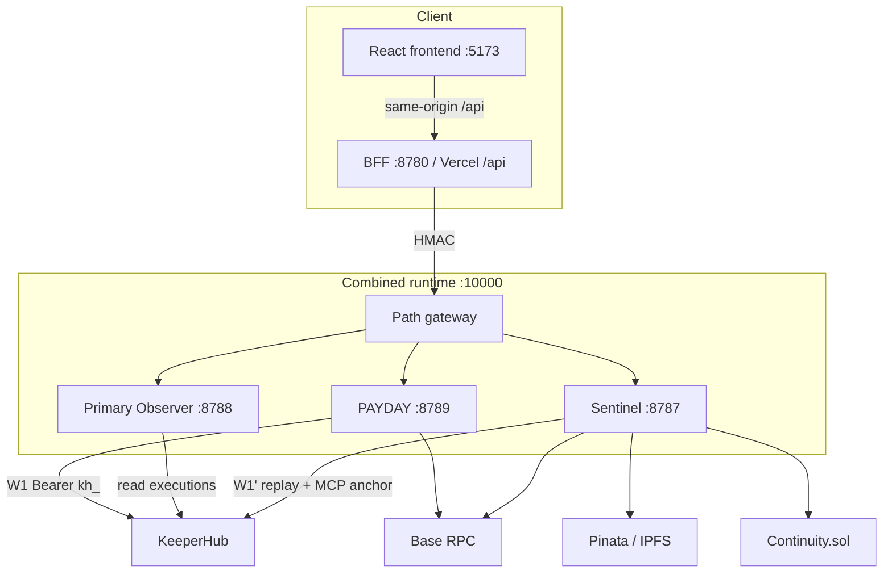
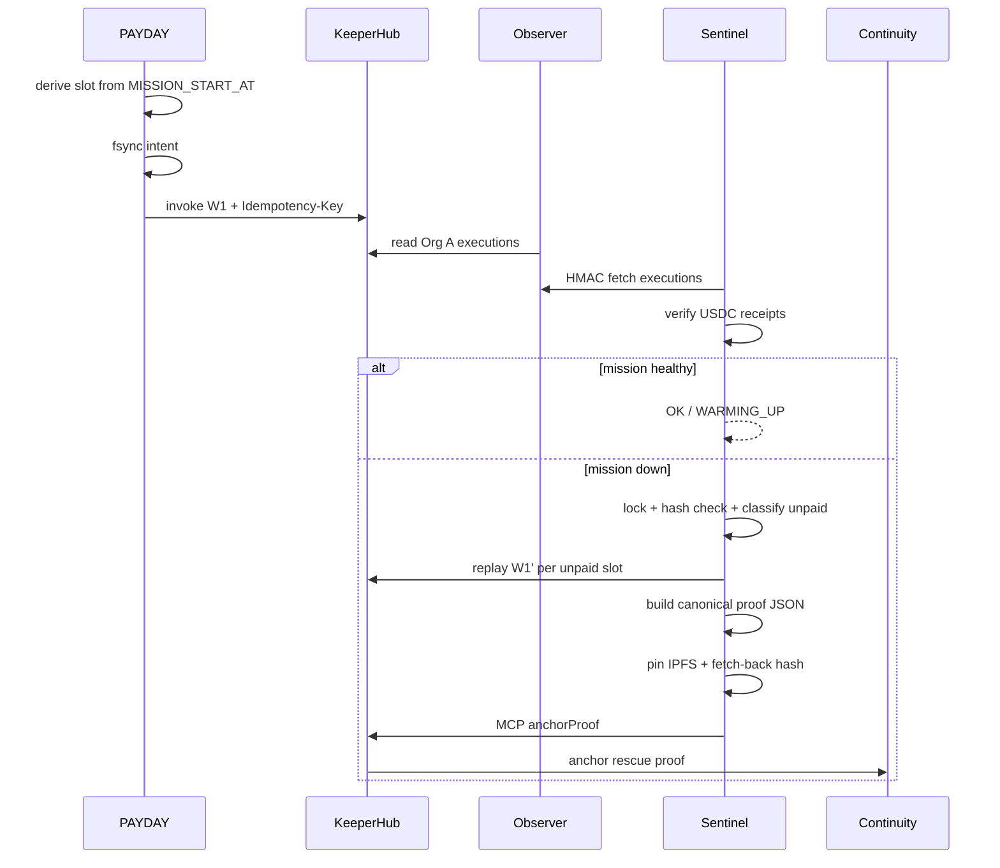

# EMBER Architecture

EMBER keeps an onchain payment mission running when its primary agent dies.

## System map

## Component ceiling

- Agents: **PAYDAY** and **Sentinel**
- Credential relay: **Primary Observer** (not a third agent)
- Contract: **`Continuity.sol`**
- Workflows: **W1** payroll, **W2** sentinel pulse, **W3** restore/replay entry  
  Org B **W1'** is a schedule-disabled replay copy — not a fourth product workflow

## Runtime flow

## Trust boundaries

| Process | Secrets allowed | Forbidden |
|---------|-----------------|-----------|
| PAYDAY | Org A executor key; optional control token | Org A observer, Org B, deployer, Pinata |
| Primary Observer | Org A observer key; Observer HMAC | Executor, Org B, deployer |
| Sentinel | Org B key; both HMAC secrets; Pinata when anchoring | Every Org A `kh_`, deployer |
| BFF / Vercel | HMAC secrets only | All `kh_`, deployer, wallet exports |
| Browser | none | everything sensitive |
| Deploy scripts | Deployer key during an explicit command | Long-running service env |

KeeperHub keys are full-scope. “Read-only” for Observer is enforced by route surface and process isolation.

## Frontend architecture

- **Vite + React** SPA in `frontend/`
- **BFF** signs HMAC and proxies to the runtime — secrets never ship to the browser
- **DEVELOPMENT_MODE** swaps live upstream for `scripts/dev-mock-runtime.mjs` + `fixtures/dev/*`

See also: `docs/FRONTEND_ARCHITECTURE.md`, `frontend/DESIGN.md`.

## Correctness invariants

- A mission slot has at most one accepted PAYDAY execution key  
- Rescue replays only receipt-unpaid and journal-uncovered slots  
- A rescue ID is anchored once  
- Replay/anchor crashes resume through the same KeeperHub idempotency key  
- A rescue uses one fee mode  
- Mainnet is never selected implicitly  
- Proof is never anchored before fetch-back hash equality  
- Imported replay workflow remains schedule-disabled  

## Persistence

No database required for the reference design. Append-only journals on local `runtime/` or Render persistent disks:

- `PAYDAY_JOURNAL_DIR`
- `RESCUE_JOURNAL_DIR`

## Related docs

- [`LOCAL_SETUP.md`](./LOCAL_SETUP.md)
- [`DEPLOYMENT.md`](./DEPLOYMENT.md)
- [`API_REFERENCE.md`](./API_REFERENCE.md)
- [`MCP_GUIDE.md`](./MCP_GUIDE.md)
- [`docs/RUNBOOK.md`](./docs/RUNBOOK.md)
- [`docs/SERVICE_AUTH.md`](./docs/SERVICE_AUTH.md)
- [`docs/THREAT_MODEL.md`](./docs/THREAT_MODEL.md)
