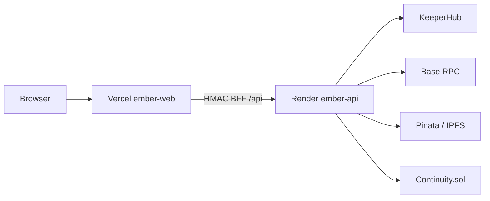

# Deployment

## Overview

EMBER deploys as two public surfaces:

1. **Runtime API** — Node combined process (`scripts/start-ember-runtime.mjs`) on Render (or any Node host)
2. **Frontend + BFF** — Vite static assets + serverless `/api/*` on Vercel



## Frontend (Vercel)

Project settings that matter:

| Setting | Value |
|---------|-------|
| Root Directory | `frontend` |
| Install Command | `cd .. && corepack enable && pnpm install --frozen-lockfile` |
| Build Command | `pnpm build` |
| Output Directory | `dist` |
| Node | 20+ / 24 |

Config file: `frontend/vercel.json`

### Required Vercel env vars

Copy from `frontend/.env.example` into Vercel Project → Environment Variables for Production + Preview:

- `EMBER_RUNTIME_URL` — public Render URL (e.g. `https://ember-api-….onrender.com`)
- `EMBER_NETWORK`
- `SENTINEL_SHARED_SECRET`
- `PRIMARY_OBSERVER_SHARED_SECRET`
- Mission / continuity / workflow IDs
- `IPFS_GATEWAY`

Never put KeeperHub `kh_` keys in `VITE_*` browser variables.

### Deploy

```bash
git push origin main
# or
cd frontend && npx vercel --prod
```

## Backend (Render)

Blueprint: `render.yaml`  
Start command: `node scripts/start-ember-runtime.mjs`  
Build: `corepack enable && pnpm install --frozen-lockfile && pnpm build`

### Persistent disk

Mount a disk at `/var/data/ember` (or configure):

```
PAYDAY_JOURNAL_DIR=/var/data/ember/payday
RESCUE_JOURNAL_DIR=/var/data/ember/rescues
```

### Env restore helper

```bash
# uses allowlisted keys from local .env — never prints secret values
node scripts/restore-ember-api-env.mjs
```

Optional operator script: `pnpm deploy:render` (`scripts/deploy-render-free.mjs`). Override repo/service names via env — do not hardcode another developer’s Render IDs in your fork.

### Health

- `GET /healthz`
- `GET /readyz`
- `GET /status`

## Contracts

Deploy `Continuity.sol` with Foundry on the target chain. Record:

- `CONTINUITY_ADDRESS_*`
- `MISSION_ID_*`
- `WORKFLOW_HASH_*`
- `MISSION_START_AT*`

Mainnet requires explicit human approval and funded org wallets.

## Production checklist

- [ ] `DEVELOPMENT_MODE=0` on all hosts
- [ ] Distinct HMAC secrets
- [ ] Org A keys never loaded into Sentinel
- [ ] Org B keys never loaded into PAYDAY / Observer
- [ ] Pinata JWT only where proof anchoring is enabled
- [ ] `pnpm doctor` pass against production env (offline checks)
- [ ] Render healthz green
- [ ] Vercel `/api/health` shows `bff: ok` and upstream 200
- [ ] Secrets not in git history

## Rollback

1. Point Vercel `EMBER_RUNTIME_URL` back to the previous healthy runtime
2. Redeploy previous Render commit / resume previous service
3. Keep journal disks intact — do not wipe rescue journals during incident response
