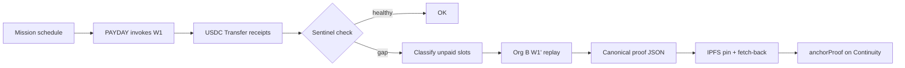
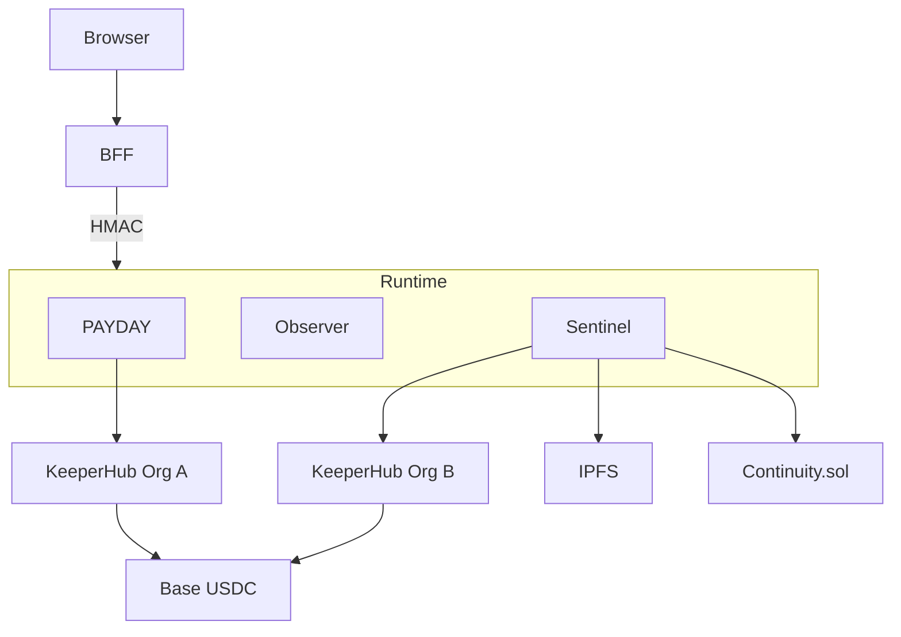

<p align="center">
  
</p>

# EMBER

**When the agent dies, the mission survives.**

KeeperHub executes.  
EMBER recovers missed obligations.

[Live app](https://ember-web-seven.vercel.app) · [Evidence](./docs/evidence/README.md) · [Mission Continuity Kit](./packages/continuity-kit) · [Adoption](./docs/KEEPERHUB_CONTINUITY_ADOPTION.md) · [Submission](./SUBMISSION.md)

[](https://github.com/mohamedwael201193/ember/actions/workflows/ci.yml)
[](https://basescan.org/tx/0xd26e61743539711fe103fc2b63ccb814725cf99c24fa417c966505a338341ea2)
[](https://app.keeperhub.com/workflows/5goaid2zjgzyb32661se3)
[](#quick-start)
[](#quick-start)
[](./LICENSE)

---

## 30-second judge card

| | |
| --- | --- |
| **Problem** | Autonomous payment agents die mid-cadence. Retries of a *requested* run are not the same as recovering a slot that was *never requested*. |
| **Why KeeperHub** | Every USDC transfer and anchor lands through KeeperHub workflows on Base. |
| **What EMBER adds** | Missed-slot detection, dual-org standby replay, journal exactly-once, IPFS proof, `Continuity.sol` seal. |
| **Primary mainnet tx** | [`0xd26e6174…341ea2`](https://basescan.org/tx/0xd26e61743539711fe103fc2b63ccb814725cf99c24fa417c966505a338341ea2) |
| **Primary KH run** | workflow `5goaid2zjgzyb32661se3` · execution `667ekg3qk5f45127eqjyy` |
| **Rescue tx** | [`0x47437621…8e41`](https://basescan.org/tx/0x474376218593b8d3fbecb103286129b91dd6590fad779514b636cc480d6c8e41) |
| **Proof CID** | [`QmVr6yWD…Woyn`](https://ipfs.io/ipfs/QmVr6yWDfuWbWE4m9UADtbJzSadqKXnUmpCHUERjsLWoyn) |
| **Anchor** | [`0x74ba1eac…211f`](https://basescan.org/tx/0x74ba1eac3e35c269175c06629782f66da454775141b6c94f14d608065c8d211f) |
| **MCP evidence** | [`docs/evidence/mcp-continuity-demo-2026-08-11.json`](./docs/evidence/mcp-continuity-demo-2026-08-11.json) |

### Provenance labels (always)

| Label | Meaning |
| --- | --- |
| **LIVE RUNTIME / LIVE OBSERVER** | Talking to live APIs; production payment writes may be disabled |
| **CERTIFIED MAINNET SNAPSHOT** | Frozen Base mainnet evidence — real history, not a fresh spend |
| **DEMO FIXTURE** | Local sample data only |

Production public UI prefers certified snapshots for the payment story when live writes are off. That is intentional honesty, not theater.

```bash
git clone https://github.com/mohamedwael201193/ember.git && cd ember
corepack enable && pnpm install
pnpm setup && pnpm doctor && pnpm test && pnpm build
```

No private keys required for inspect / test / build. Writes stay gated.

---

## Table of contents

- [Problem](#problem)
- [Solution](#solution)
- [How EMBER works](#how-ember-works)
- [Architecture](#architecture)
- [Mission Continuity Kit](#mission-continuity-kit)
- [KeeperHub surfaces](#keeperhub-surfaces)
- [Product surfaces](#product-surfaces)
- [Folder structure](#folder-structure)
- [Quick Start](#quick-start)
- [Development mode](#development-mode)
- [Environment variables](#environment-variables)
- [API reference](#api-reference)
- [Contracts](#contracts)
- [IPFS](#ipfs)
- [Mainnet evidence](#mainnet-evidence)
- [Production / Deploy](#production--deploy)
- [MCP](#mcp)
- [Adoption](#adoption)
- [Troubleshooting](#troubleshooting)
- [FAQ](#faq)
- [Contributing](#contributing)
- [License](#license)

---

## Problem

Autonomous agent workflows that move real money fail in messy ways:

- The primary executor process dies mid-cadence  
- KeeperHub executions succeed in the API but receipts disagree  
- A naive “retry everything” double-pays  
- Proof of recovery is tribal knowledge in Slack, not onchain  

Teams need **continuity** — deterministic detection, isolated standby credentials, receipt-backed replay, and an auditable proof.

## Solution

EMBER is a small, explicit control plane:

| Piece | Role |
|-------|------|
| **PAYDAY** | Invokes the primary W1 USDC workflow on schedule |
| **Primary Observer** | Read-only Org A execution relay (credential isolation) |
| **Sentinel** | Detects gaps, replays unpaid slots via Org B W1', pins + anchors proof |
| **Continuity.sol** | Onchain rescue proof anchor |
| **Frontend + BFF** | Operator product UI — secrets never enter the browser |
| **Continuity Kit** | Reusable policy + journal helpers for other missions |

---

## How EMBER works



### Replay flow

Only slots that are **receipt-unpaid** and **not already covered by the rescue journal** are replayed. Each slot uses a deterministic KeeperHub `Idempotency-Key` so crashes resume safely.

### Proof flow

1. Build sorted canonical JSON  
2. SHA-256 hash  
3. Pin to IPFS (Pinata)  
4. Fetch CID bytes and re-hash  
5. Only then request `anchorProof`  

### Recovery flow

Rescues are journaled under `RESCUE_JOURNAL_DIR`. Steps are append-only (`hash_check` → `replay` → `proof_*` → `done`). Ambiguous crashes reconcile onchain state before writing again.

---

## Architecture

Full write-up: [`ARCHITECTURE.md`](./ARCHITECTURE.md)



---

## Mission Continuity Kit

Reusable package: [`packages/continuity-kit`](./packages/continuity-kit)  
Safe starter: [`examples/continuity-guardian`](./examples/continuity-guardian)

```bash
pnpm --filter @ember/example-continuity-guardian run setup
pnpm --filter @ember/example-continuity-guardian run doctor
pnpm --filter @ember/example-continuity-guardian inspect
```

Inspect-only by default. `WRITE_MODE=1` still refuses accidental mainnet writes unless explicitly configured for a confirmed path.

Same primitive protects payroll, treasury sweeps, liquidation bots, recurring grants, and settlement agents.

---

## KeeperHub surfaces

| Surface | How EMBER uses it |
| --- | --- |
| Workflow UI | Primary + standby canvases, Run, Runs/audit |
| MCP | `get_execution` evidence chain (see MCP artifact) |
| REST / SDK | Execute, poll, verify receipts |
| Deep links | Executions / Rescues / Proofs pages link into KeeperHub + BaseScan + IPFS |

---

## Product surfaces

Operator console under `/app`: Overview, Mission, Executions, Rescues, Proofs, Operations (Continuity SLO), Wallets, Settings.

Continuity SLO shows expected/confirmed/missed slots, recovery metrics, and provenance — **Unavailable** when a metric is not known (never fabricated).

---

## Folder structure

```text
packages/          mission-core, kh-client, receipt-checker, continuity-kit
services/          payday, primary-observer, sentinel, gateway
frontend/          Vite app + BFF
examples/          continuity-guardian starter
workflows/         KeeperHub workflow exports
contracts/         Continuity.sol (Foundry)
docs/evidence/     Certified mainnet + rehearsal artifacts
```

---

## Quick Start

**Prerequisites:** Node ≥ 20, pnpm 10 (`corepack enable`). Foundry/`forge` optional locally (required in CI).

```bash
corepack enable
pnpm install
pnpm setup
pnpm doctor
pnpm test
pnpm typecheck
pnpm build
pnpm lint
```

Dev UI (no secrets):

```bash
pnpm --filter @ember/frontend dev
```

Open **http://127.0.0.1:5173**.

### Modes

| Mode | Secrets | Spend |
| --- | --- | --- |
| Development / demo fixtures | None required | Never |
| Live observer | Read API keys optional | No writes if `PAYDAY_ENABLE=0` |
| Live write | Explicit env + confirmation | Real USDC — gated |

---

## Development mode

Development mode ships zero-secret fixtures labeled **DEMO FIXTURE**. Do not present them as mainnet.

---

## Environment variables

See [`.env.example`](./.env.example). Never commit `.env`. Auth to KeeperHub is `Authorization: Bearer kh_...` only.

---

## API reference

See [`docs/openapi`](./docs/openapi) and the BFF routes under `frontend/server`.

---

## Contracts

`Continuity.sol` on Base mainnet: [`0x068bB96e849F0DE3D49944Ec0F4aEd3D6B165770`](https://basescan.org/address/0x068bB96e849F0DE3D49944Ec0F4aEd3D6B165770)

```bash
forge test --root contracts -vv   # CI / local Foundry
```

---

## IPFS

Rescue proofs are pinned (Pinata in production evidence). Fetch-back hash must match before anchor.

Certified CID: `QmVr6yWDfuWbWE4m9UADtbJzSadqKXnUmpCHUERjsLWoyn`

---

## Mainnet evidence

Full index: [`docs/evidence/README.md`](./docs/evidence/README.md)

| Kind | Link |
| --- | --- |
| Primary PAYDAY | https://basescan.org/tx/0xd26e61743539711fe103fc2b63ccb814725cf99c24fa417c966505a338341ea2 |
| Rescue replay | https://basescan.org/tx/0x474376218593b8d3fbecb103286129b91dd6590fad779514b636cc480d6c8e41 |
| Anchor | https://basescan.org/tx/0x74ba1eac3e35c269175c06629782f66da454775141b6c94f14d608065c8d211f |
| MCP capture | [`mcp-continuity-demo-2026-08-11.json`](./docs/evidence/mcp-continuity-demo-2026-08-11.json) |

x402 marketplace fee txs are **not** continuity payroll.

---

## Production / Deploy

- Frontend: Vercel (`ember-web-seven.vercel.app`)
- Runtime: Render combined service (observer posture when payment enables are off)
- Secrets only in host env — never in the browser

---

## MCP

Official remote server: `https://app.keeperhub.com/mcp`  
Full demo path: [`docs/MCP_DEMO.md`](./docs/MCP_DEMO.md) · workshop gap notes: [`docs/KEEPERHUB_WORKSHOP_GAP_ANALYSIS.md`](./docs/KEEPERHUB_WORKSHOP_GAP_ANALYSIS.md)

### Claude Code (copy-paste)

```bash
claude mcp add --transport http --scope user keeperhub https://app.keeperhub.com/mcp
```

Then run `/mcp` for OAuth. Headless: add `--header "Authorization: Bearer kh_…"`.

### Cursor

See [`docs/mcp/cursor.mcp.json.example`](./docs/mcp/cursor.mcp.json.example) and [`MCP_GUIDE.md`](./MCP_GUIDE.md).

### Agent lifecycle (safe)

1. `tools_documentation`  
2. `get_workflow` / `validate_workflow` on `5goaid2zjgzyb32661se3`  
3. `execute_workflow` on smoke `vewqfp44zmpa9dtctlrdr` (Sepolia read — no spend)  
4. `get_execution`  
5. Inspect certified mainnet run `667ekg3qk5f45127eqjyy` (read-only)

Capture script: `scripts/capture-mcp-continuity-evidence.ts` (read-only by default).  
Artifacts: `docs/evidence/mcp-continuity-demo-2026-08-11.json`, `docs/evidence/mcp-agent-lifecycle-2026-08-11.json`.

---

## Adoption

[`docs/KEEPERHUB_CONTINUITY_ADOPTION.md`](./docs/KEEPERHUB_CONTINUITY_ADOPTION.md)  
Execution Recovery Contract Pack v1: [`docs/keeperhub-contribution/execution-recovery-contract-pack-v1/`](./docs/keeperhub-contribution/execution-recovery-contract-pack-v1/)  
Targets open [`KeeperHub/cli` #53](https://github.com/KeeperHub/cli/issues/53); does not overlap PR #95.

---

## Troubleshooting

- `pnpm doctor` — env / tool presence  
- `pnpm security:secrets` — secret scan  
- CI: `.github/workflows/ci.yml` (format, lint, typecheck, test, build, forge)

---

## FAQ

**Is production “live spending”?** Often **LIVE OBSERVER** + **CERTIFIED MAINNET SNAPSHOT** for the payment story. Check provenance badges in the UI.

**Does EMBER replace KeeperHub?** No. KeeperHub executes. EMBER recovers missed obligations.

**Can I clone without keys?** Yes for setup/doctor/test/build/inspect.

---

## Contributing

See adoption docs before proposing KeeperHub upstream changes. Prefer small fixture PRs over large merges.

---

## License

MIT — see [`LICENSE`](./LICENSE).
