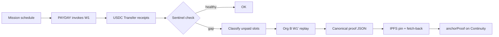
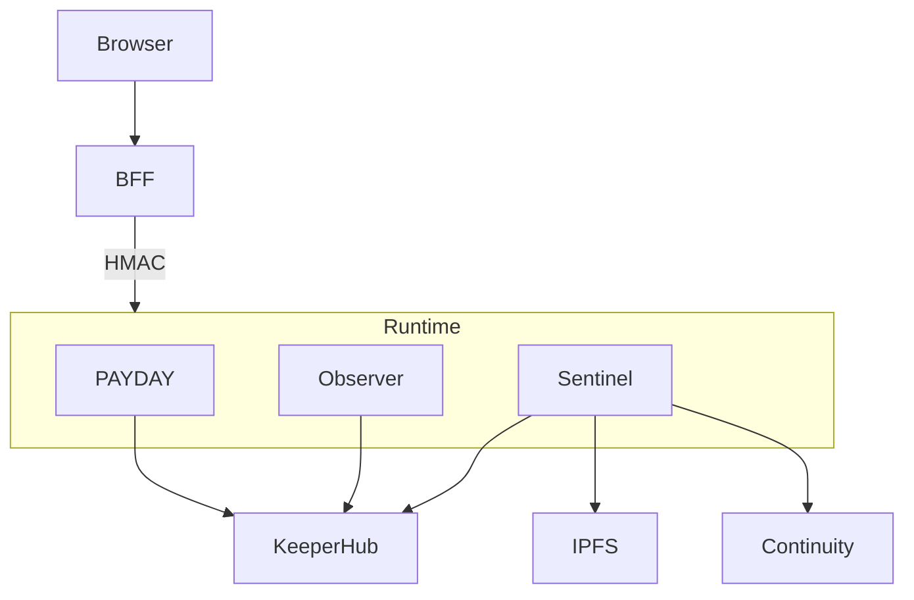

<p align="center">
  
</p>

# EMBER

**AI continuity for onchain payment missions.**

EMBER keeps a payroll-style USDC mission alive when the primary KeeperHub agent dies. It detects unpaid slots from receipts, replays only what is missing from an isolated standby organization, pins a canonical rescue proof to IPFS, and anchors that proof in `Continuity.sol`.

[](#quick-start)
[](#quick-start)
[](./LICENSE)
[](#development-mode)

```bash
git clone <repo-url> ember && cd ember
corepack enable && pnpm install
pnpm setup && pnpm doctor && pnpm dev
```

Open **http://127.0.0.1:5173** — no KeeperHub account required in development mode.

---

## Table of contents

- [Problem](#problem)
- [Solution](#solution)
- [How EMBER works](#how-ember-works)
- [Architecture](#architecture)
- [Product surfaces](#product-surfaces)
- [Folder structure](#folder-structure)
- [Quick Start](#quick-start)
- [Development mode](#development-mode)
- [Environment variables](#environment-variables)
- [API reference](#api-reference)
- [Contracts](#contracts)
- [KeeperHub](#keeperhub)
- [IPFS](#ipfs)
- [Mainnet](#mainnet)
- [Production / Deploy](#production--deploy)
- [MCP](#mcp)
- [Troubleshooting](#troubleshooting)
- [FAQ](#faq)
- [Contributing](#contributing)
- [License](#license)

---

## Problem

Autonomous agent workflows that move real money fail in messy ways:

- The primary executor process dies mid-cadence  
- KeeperHub executions succeed in the API but receipts disagree  
- A naive “retry everything” double-pays  
- Proof of recovery is tribal knowledge in Slack, not onchain  

Teams need **continuity** — deterministic detection, isolated standby credentials, receipt-backed replay, and an auditable proof.

## Solution

EMBER is a small, explicit control plane:

| Piece | Role |
|-------|------|
| **PAYDAY** | Invokes the primary W1 USDC workflow on schedule |
| **Primary Observer** | Read-only Org A execution relay (credential isolation) |
| **Sentinel** | Detects gaps, replays unpaid slots via Org B W1', pins + anchors proof |
| **Continuity.sol** | Onchain rescue proof anchor |
| **Frontend + BFF** | Operator product UI — secrets never enter the browser |

---

## How EMBER works



### Replay flow

Only slots that are **receipt-unpaid** and **not already covered by the rescue journal** are replayed. Each slot uses a deterministic KeeperHub `Idempotency-Key` so crashes resume safely.

### Proof flow

1. Build sorted canonical JSON  
2. SHA-256 hash  
3. Pin to IPFS (Pinata)  
4. Fetch CID bytes and re-hash  
5. Only then request `anchorProof`  

### Recovery flow

Rescues are journaled under `RESCUE_JOURNAL_DIR`. Steps are append-only (`hash_check` → `replay` → `proof_*` → `done`). Ambiguous crashes reconcile onchain state before writing again.

---

## Architecture

Full write-up: [`ARCHITECTURE.md`](./ARCHITECTURE.md)



**Trust rule:** Org A `kh_` keys never load into Sentinel. Org B keys never load into PAYDAY or Observer. The browser receives zero secrets.

---

## Product surfaces

Capture PNGs into `docs/screenshots/` (see that folder’s README). Until then, run locally:

| Surface | Route | What you should see |
|---------|-------|---------------------|
| **Landing** | `/` | Brand-first cinematic story |
| **Dashboard** | `/app` | Living console / mission overview |
| **Mission Wizard** | `/app/mission/new` | Guided mission builder |
| **Proofs** | `/app/proofs` | CID, anchor tx, explorer links |
| **Rescue / Replay** | `/app/rescues` | Unpaid slots, replay intents, journal |
| **Ops** | `/app/ops` | Runtime readiness |

Brand assets: `frontend/public/ember.svg`, `frontend/public/ember-orbit-signal.png`.

---

## Folder structure

```
ember/
├── contracts/               # Continuity.sol + Foundry tests
├── docs/                    # runbooks, OpenAPI, MCP examples, evidence
├── fixtures/dev/            # sample missions, proofs, wallets (dev mode)
├── frontend/                # React UI + BFF + Vercel api/
├── packages/
│   ├── mission-core/        # schedule, HMAC, proof, env schemas
│   ├── kh-client/           # KeeperHub REST/MCP client
│   └── receipt-checker/     # USDC Transfer verification
├── scripts/
│   ├── setup.mjs            # pnpm setup
│   ├── doctor.mjs           # pnpm doctor
│   ├── dev.mjs              # pnpm dev
│   ├── start-ember-runtime.mjs
│   └── …
├── services/
│   ├── payday/
│   ├── primary-observer/
│   └── sentinel/
├── workflows/               # W1 / W2 / W3 JSON artifacts
├── .env.example             # every documented variable
├── ARCHITECTURE.md
├── LOCAL_SETUP.md
├── DEPLOYMENT.md
├── API_REFERENCE.md
├── MCP_GUIDE.md
├── CONTRIBUTING.md
└── LICENSE
```

---

## Quick Start

### Requirements

- Node.js **≥ 20** (24 recommended for Render parity)  
- **pnpm 10** via Corepack (`packageManager` field pins `pnpm@10.34.5`)  
- Git  

No global CLIs, no Cursor requirement, no pre-seeded secrets.

### Install + run

```bash
corepack enable
pnpm install
pnpm setup          # creates .env in DEVELOPMENT_MODE, folders, fixtures check
pnpm doctor         # toolchain + env + ports + optional probes
pnpm dev            # mock runtime + BFF + Vite + watcher
```

| URL | Purpose |
|-----|---------|
| http://127.0.0.1:5173 | Product UI |
| http://127.0.0.1:8780/api/health | BFF |
| http://127.0.0.1:10000/healthz | Runtime |

Deep dive: [`LOCAL_SETUP.md`](./LOCAL_SETUP.md)

---

## Development mode

When `DEVELOPMENT_MODE=1` (default from `pnpm setup`):

- Mock runtime serves `/healthz`, `/check`, `/rescue`, `/v1/executions`  
- BFF loads `fixtures/dev/sample-*.json`  
- UI works for landing, dashboard, mission wizard, proofs, rescue history  
- **No** real KeeperHub, Pinata, or funded wallets required  

Turn off for live integration:

```env
DEVELOPMENT_MODE=0
EMBER_NETWORK=mainnet   # or rehearsal / sepolia values you intend
```

Then fill live credentials and run `pnpm doctor` until it passes.

---

## Environment variables

**Source of truth:** [`.env.example`](./.env.example)  
Frontend/BFF subset: [`frontend/.env.example`](./frontend/.env.example)

Never require an undocumented variable. If you add one, update both examples, `pnpm doctor`, and this README.

### Mode

| Variable | Default | Description |
|----------|---------|-------------|
| `DEVELOPMENT_MODE` | `1` | `1` = sample stack |
| `EMBER_DEV_MODE` | `1` | Alias for development mode |
| `EMBER_NETWORK` | `development` | `development` \| `mainnet` \| sepolia-style configs |
| `EMBER_RUNTIME_URL` | `http://127.0.0.1:10000` | Runtime base URL for BFF |

### KeeperHub

| Variable | Required live | Description |
|----------|---------------|-------------|
| `KH_API_BASE` | yes | API host |
| `KH_MCP_URL` | for anchor | MCP host |
| `KH_API_KEY_PRIMARY_EXECUTOR` | yes | Org A executor |
| `KH_API_KEY_PRIMARY_OBSERVER` | yes | Org A observer |
| `KH_API_KEY_STANDBY` | yes | Org B standby |
| `KH_ORG_*_WORKFLOW_ID` | yes | W1 / W1' / W2 / W3 ids |
| `ORG_*_WALLET_*` | yes | Wallet addresses / integration ids |

Auth is always `Authorization: Bearer kh_…` — never `X-API-Key`.

### Chain / mission / IPFS / services

See `.env.example` for the full list: RPC URLs, USDC addresses, continuity addresses, mission IDs, workflow hashes, Pinata, ports, HMAC secrets, journal directories, Render deploy tooling.

**HMAC rule:** `SENTINEL_SHARED_SECRET` ≠ `PRIMARY_OBSERVER_SHARED_SECRET`.

---

## API reference

See [`API_REFERENCE.md`](./API_REFERENCE.md) and [`docs/openapi/ember-services.openapi.yaml`](./docs/openapi/ember-services.openapi.yaml).

Quick BFF:

```bash
curl -s http://127.0.0.1:8780/api/health
curl -s http://127.0.0.1:8780/api/snapshot
curl -s http://127.0.0.1:8780/api/evidence/mainnet
```

---

## Contracts

- Solidity: `contracts/src/Continuity.sol`  
- Tests: Foundry (`forge test`)  
- Optional — not required for `pnpm dev` in development mode  

```bash
cd contracts
forge test
```

---

## KeeperHub

- Typed client: `packages/kh-client`  
- Workflow artifacts: `workflows/`  
- Dual-org model: Org A primary, Org B standby replay  

MCP configuration for Cursor / Claude / VS Code: [`MCP_GUIDE.md`](./MCP_GUIDE.md)

---

## IPFS

When `PROOF_ANCHOR_ENABLE=1`:

- `PINATA_JWT` required  
- `IPFS_GATEWAY` used for fetch-back verification  
- Proof bytes must hash-equal before `anchorProof`  

In development mode anchoring is off by default.

---

## Mainnet

Mainnet is **explicit** (`EMBER_NETWORK=mainnet`) and operationally gated:

- Funded org wallets + spend caps  
- Real workflow IDs / continuity address  
- Human approval before enabling PAYDAY (`PAYDAY_ENABLE`)  

Historical certification notes live in `FINAL_BACKEND_CERTIFICATION.md` and `docs/evidence/`. Treat them as evidence, not as your local defaults.

---

## Production / Deploy

| Surface | Platform | Entry |
|---------|----------|-------|
| Runtime | Render (or any Node host) | `pnpm build && pnpm start` |
| Frontend + BFF | Vercel | `frontend/` + `frontend/vercel.json` |

Full guide: [`DEPLOYMENT.md`](./DEPLOYMENT.md)

---

## MCP

Documented end-to-end in [`MCP_GUIDE.md`](./MCP_GUIDE.md).

Examples:

- `docs/mcp/cursor.mcp.json.example`  
- `docs/mcp/claude-desktop.mcp.json.example`  
- `docs/mcp/vscode.mcp.json.example`  

---

## Troubleshooting

| Symptom | Fix |
|---------|-----|
| `pnpm: command not found` | `corepack enable && corepack prepare pnpm@10.34.5 --activate` |
| Node too old | Install Node 20+ |
| Port in use | `pnpm doctor` → free 5173/8780/10000 or change env ports |
| BFF 500 missing secrets | Run `pnpm setup` or set HMAC secrets |
| Runtime 502 on Render | Cold start — retry `/healthz`; check disk + env |
| Doctor fails live checks | Set `DEVELOPMENT_MODE=1` for UI work, or fill real keys |
| Foundry path errors | Use your local `forge`; ignore any old WSL absolute paths in historical notes |

Always start with:

```bash
pnpm doctor
```

---

## FAQ

**Do I need KeeperHub to try the UI?**  
No — `DEVELOPMENT_MODE=1` is enough.

**Do I need Docker?**  
No. Optional compose files are not the primary path.

**Do I need Cursor?**  
No. MCP is optional for operators who use agent tooling.

**Where do secrets live?**  
Root `.env` and host env vars (Render/Vercel). Never the browser.

**Can I rename the Render URL?**  
Service slugs are immutable on Render. Create a new service or attach a custom domain — see `DEPLOYMENT.md`.

**Is there a database?**  
No. Journals on disk are enough for the reference single-instance design.

---

## Contributing

See [`CONTRIBUTING.md`](./CONTRIBUTING.md).

```bash
pnpm lint && pnpm typecheck && pnpm test
```

---

## License

[MIT](./LICENSE) © EMBER contributors

---

## Docs index

| Doc | Purpose |
|-----|---------|
| [`LOCAL_SETUP.md`](./LOCAL_SETUP.md) | Clone → running |
| [`DEPLOYMENT.md`](./DEPLOYMENT.md) | Vercel + Render |
| [`ARCHITECTURE.md`](./ARCHITECTURE.md) | System design |
| [`API_REFERENCE.md`](./API_REFERENCE.md) | HTTP surfaces |
| [`MCP_GUIDE.md`](./MCP_GUIDE.md) | Agent / IDE MCP |
| [`CONTRIBUTING.md`](./CONTRIBUTING.md) | PR workflow |
| [`docs/RUNBOOK.md`](./docs/RUNBOOK.md) | Chaos + ops |
| [`docs/SERVICE_AUTH.md`](./docs/SERVICE_AUTH.md) | HMAC details |
| [`docs/THREAT_MODEL.md`](./docs/THREAT_MODEL.md) | Threat model |
